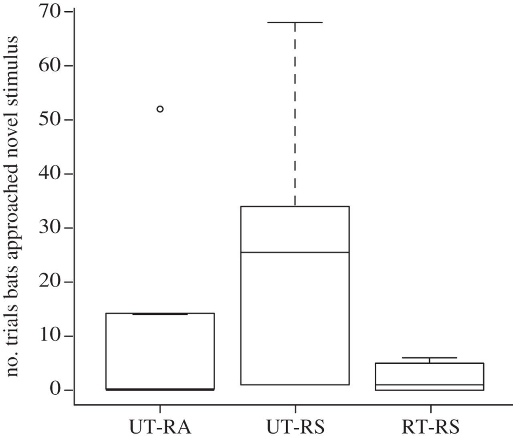
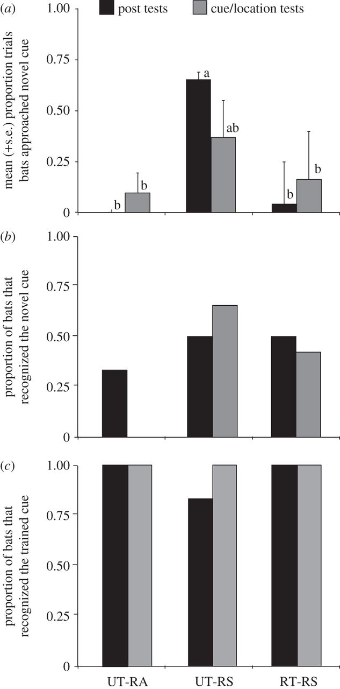

I reanalyzed data from a study published in 2013 by Jones et al.. This was a study done in fringe-lipped (frog-eating) bats investigating how the reliability of self-aquired prey cues affected the use of socially aquired prey cues. 

Here they trained bats to a novel cue (cell phone ring tone) and then manipulated the reward schedule of this cue. Bats were then assigned to different treatment groups that varied in their reward schedule for that cue. Individuals were then exposed to a conspecific tutor that was trained to a different cue, which was always rewarded, or just the different cue with no tutor.

There were five main components in this experiment: the intial training phase, a set of pre-tests, and experimental exposure phase, a set of post-tests, and a set of cue/location tests. 


```{r}
#bringing in the data
library(curl)
x1<-curl("https://raw.githubusercontent.com/cthemingway12/Data-reanalysis-assignment-/master/sl.csv")
sl<-read.csv(x1, header = TRUE, sep = ",")
head(sl)
sl$v13
class(sl$v13)
sl<-na.omit(sl)
```

1. Experience tests:
```{r}
#Welches two-sample t-test comparing inital preference based on training between the two inital groups trained to A and B
#the author did this test with the intial training times for the bats but this data is not available. This analysis in not actually in the paper but was run to compare inital preferences for either call based on their training. Author used a GEE to analyze this in the paper, which I attempt below.
v5<-as.factor(sl$v5)
training<-sl$training

#Individuals trained to A
slA<-sl[sl$training == "A", ]
slA

slB<-sl[sl$training == "B", ]  
slB

mean(slA$v6)
mean(slB$v6)

#difference between the groups in number of approaches to trained cues:
t<-t.test(x=slA$v6,y=slB$v6, mu=0, var.equal=TRUE, alternative="two.sided")
t

#differences between the groups in number of approaches to novel cue:
mean(slA$v7)
mean(slB$v7)

t1<-t.test(x=slA$v7,y=slB$v7, mu=0, var.equal=TRUE, alternative="two.sided")
t1
```

2. Post-tests:
```{r}
#Fisher's exact test to determine whether proportion of individuals in different treatment groups approached novel cue in post test differently.
#proportion of bats that recognize novel cue in post-tests in the different treatment groups 
UTRA<-sl[sl$treatment == "UT-RA",]
UTRA
#2/6 individuals in UT-RA group recognized novel cue
RTRS<-sl[sl$treatment == "RT-RS",]
RTRS
#3/6 individuals in RT-RS group recognized novel cue
UTRS<-sl[sl$treatment == "UT-RS",]
UTRS
#3/6 individuals in UT-RS group recognized novel cue
m1<-matrix(data=c(2,3,3,6,6,6), nrow=2, ncol=3, byrow=TRUE)
m1
fisher.test(m1, alternative = "two-sided")
#no significant differences between treatments in recognition of the novel cue

#proportion of bats that recognize trained cue in post-tests in the different treatment groups (column v10)
m2<-matrix(data=c(6,6,5,6,6,6), nrow=2, ncol=3, byrow=TRUE)
m2
fisher.test(m2, alternative = "two-sided")

#Generalized Estimation Equations
install.packages("geepack")
library(geepack)
sl$v9
propnovel<-(sl$v9)/4
propnovel
geeglm(propnovel~treatment, family=binomial, id=bat, data=sl)
summary(gee(prefnov~treatment, id=bat, data=sl))

```

3. Cue/location tests:
```{r}
#t-test within the UT-RA treatment group to test for differences in preference for novel cue in the post-test and the cue/location tests
UTRA
#one of these vectors has an na. 
#recreate individual vectors to pull out individuals who did not go through both treatments (na in the data set)
v1<-c(0,0,0,0,0)
v2<-c(1,0,0,0,0)
v2<-v2/2
v4
t2<-t.test(x=v1,y=v2, paired=TRUE)
t2
#not significant

#Same test in the RT-RS treatment group:
RTRS
class(RTRS$v9)
class(RTRS$v13)
RTRS$v13<-as.integer(RTRS$v13)
RTRS
class(RTRS$v13)

v3<-RTRS$v9/4
v3
v4<-RTRS$v13/2
v4
t3<-t.test(x=v3,y=v4, paired=TRUE)
t3
#not significant

#Same test in the UT-RS treatment group:
UTRS
v5<-c(0,4,4,4)
v6<-c(0,2,1,0)
v5<-v5/4
v6<-v6/2

t4<-t.test(x=v5,y=v6, paired=TRUE)
t4
#not significant

#Fisher's exact test comparing the number of bats in each treatment that approahed the novel cue in the opposite location 
#this data is found in column v15
#this column shows whether individuals appraoched novel cue in the recognition test and is coded for 0=no and 1=yes
UTRA
#0 out of 5 individuals flew to novel cue here
RTRS
#3 out of 6 individuals flew to novel cue here
UTRS
#3 out of 5 individuals flew to novel cue here
m12<-matrix(data=c(0,3,3,5,6,5), nrow=2, ncol=3, byrow=TRUE)
m12
fisher.test(m12)
#not significant

#Testing whether bats differed in their recognition of the novel cue depending on whether they had recognized the novel cue in the post-tests 
#Analysis of variance
v11<-sl$v11[!is.na(sl$v11)]
v11
class(v11)

as.integer(sl$v15)
v15<-sl$v15[!is.na(sl$v15)]
v15
class(v15)
as.integer(v15)
m13<-aov(data=sl, v15~v11)
m13
summary(m13)

#had trouble removing the na from the different vectors for this comparrison, so I pulled out the data and put it in a new vector.
vpost<-c(1,0,0,1,0,0,0,1,1,1,0,0,1,0,1,1)
vcue<-c(0,0,0,0,0,0,0,1,1,1,0,0,1,0,1,1)

m14<-aov(vcue~vpost)
m14
summary(m14)
#Kruskal-Wallis AOV:
pairwise.t.test(vcue, vpost, p.adj="bonferroni")

#Recognition of novel cue in the post test was a significant predictor of recognition of novel cue in the cue/location tests.
```



Replot of Figure 3:
```{r}
b<-boxplot(sl$v7~sl$treatment)
means<-tapply(sl$v7,sl$treatment,mean)
points(means, col="red",pch=18)
#Here is the box and whisker plot that is presented in Figure 3 - I have modified it slightly to now also show the means.

#could also do this in ggplot
library(ggplot2)
b0<-qplot(treatment,v7,data=sl,geom='boxplot')
b1<-b0+stat_summary(fun.y=mean, shape=1, col='red', geom='point')
print(b1)
```



Recreating Figure 4
```{r}
#Figure 4a:

#need to calculate the proportion of trials that the bats flew to the novel over the trained cues in both the post-test and the cue/location tests
#in the post-test, there were a total of 4 trials per bat (24 trials for treatments with all 6 bats)
#in the cue/location tests, there were a total of 2 trials per bat (12 trials per 6 bats)

#for UTRA treatment
UTRA$v9
UTRA$v13
utrapost<-(0+0+0+0+0+0)/24
utrapost
utracue<-(1+0+0+0+0)/10
utracue

RTRS$v9
RTRS$v13
rtrspost<-(0+0+0+0+0+1)/24
rtrspost
rtrscue<-(2+0+0+0+0+0)/12
rtrscue

UTRS$v9
UTRS$v13
utrspost<-(3+0+4+0+4+4)/24
utrspost
utrscue<-(0+2+1+0)/8
utrscue

#use all of these values to create a new data frame with these proportions 
library(ggplot2)
x2<-curl("https://raw.githubusercontent.com/cthemingway12/Data-reanalysis-assignment-/master/Fig4a.csv")
fig4a=read.csv(x2, header=FALSE, sep=",")
colnames(fig4a)=c("treatment","test.type","proportion")
fig4a

library(ggplot2)
p=ggplot(fig4a,aes(x=factor(test.type),y=proportion,fill=test.type))+geom_bar(stat="identity")
p=p+facet_wrap(~treatment)
p


#Figure 4b:

library(ggplot2)
x3<-curl("https://raw.githubusercontent.com/cthemingway12/Data-reanalysis-assignment-/master/Fig4b.csv")
fig4b=read.csv(x3, header=FALSE, sep=",")
colnames(fig4b)=c("treatment","test.type","proportion")
fig4b

library(ggplot2)
p=ggplot(fig4b,aes(x=factor(test.type),y=proportion,fill=test.type))+geom_bar(stat="identity")
p=p+facet_wrap(~treatment)
p

#figure 4c:

library(ggplot2)
x4<-curl("https://raw.githubusercontent.com/cthemingway12/Data-reanalysis-assignment-/master/Fig4c.csv")
fig4c=read.csv(x4, header=FALSE, sep=",")
colnames(fig4c)=c("treatment","test.type","proportion")
fig4c

library(ggplot2)
p=ggplot(fig4c,aes(x=factor(test.type),y=proportion,fill=test.type))+geom_bar(stat="identity")
p=p+facet_wrap(~treatment)
p
